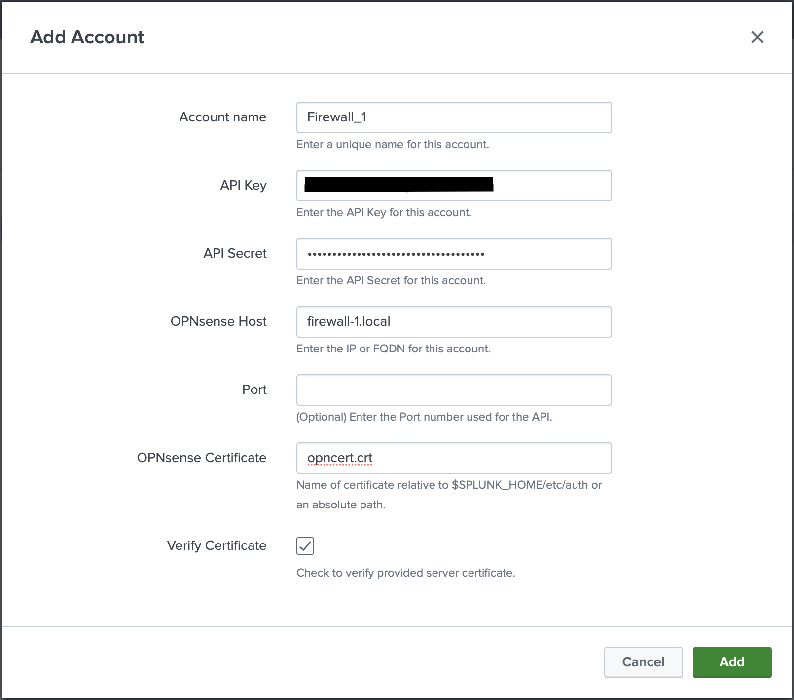
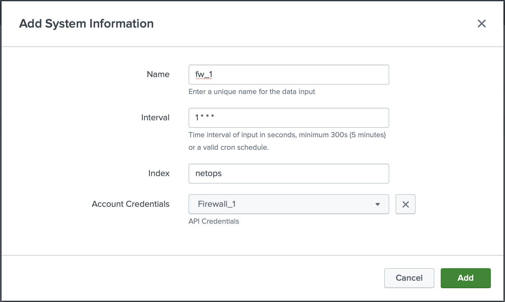

# Configure Modular Input

The TA-opnsense modular input will interact with the OPNsense API using GET requests. This allows for system information to be returned to enrich the already ingested Splunk data. For more information on what data is collected by this modular input see [Reference: Modular Input](../../../reference/reference-mod-input/) in this documentation.

## Overview

1. Perform [prerequisites](#prerequisites)
1. [Create Account](#create-account)
1. [Create Input](#create-input)

???+ info "Tested Versions"
    OPNsense **v21.7**

    Add-on Version **1.4.0**


## Prerequisites

1. Obtain [API Credentials](#obtain-api-credentials).
1. FQDN/IP of the OPNsense instance (multiple instances may be setup through the interface).
1. <small>_(optional)_</small> [CA Certificate for OPNsense instance](#obtain-ca-certificate).
1. Splunk must be able to communicate to the firewall directly through the web port <small>(default 443/tcp)</small> or through a proxy.

### Obtain API Credentials

1. Log in to the OPNsense web interface.
1. Navigate to System > Access > Users.
1. Create a new user or edit an existing user.
1. Scroll down to the `API keys` section, click the "+" to create new API credentials. This downloads an "apikey.txt" file containing the credentials for the API. **These will be used in later steps**.

### Obtain CA Certificate

!!! info "Optional"

The Certificate Authority (CA) certificate can be used to verify authenticity of the device you are connecting to.

1. Log in to the OPNsense web interface.
1. Navigate to System > Trust > Authorities.

    ??? question "Not Seeing any Certificates?"
        If no certificates show up in this view, this could mean that you are using the default self-signed Web certificate from OPNsense. If this is the case, skip these steps and ensue the "Verify Certificate" checkbox is **not** checked when setting up the modular input. For better security, it is recommended to create a new certificate for the OPNsense web interface (see [OPNsense Documentation](https://docs.opnsense.org/manual/certificates.html) for more information).

1. Export the CA cert of the Authority being used for the web interface.
1. Place the CA Certificate into `$SPLUNK_HOME/etc/auth`. It may be easier to create a new directory to keep this certificate separate <small>(i.e. `$SPLUNK_HOME/etc/auth/opnsense_certs`)</small>.

## Create Account

At least one account is needed for the modular input to work.

{ loading=lazy width=500 align=right }

1. Verify [Prerequisites](#prerequisites) have been completed before proceeding.
1. Log in to the Splunk web interface.
1. Navigate to the OPNsense Add-on for Splunk > Configuration (Tab).

    ??? question "Not seeing the OPNsense Add-on?"
        The OPNsense Add-on for Splunk must be set to visible in order to configure the modular input.

        1. In Splunk web, navigate to the "Manage Apps" view by clicking the gear icon on the Launcher page or click "Manage Apps" from the "Apps" dropdown next to the Splunk logo on the top left of the screen.
        1. In the app list search for "OPNsense Add-on" and click "Edit properties" on the right side.
        1. Ensure "Visible" is set to Yes and save.

1. Add a new Account.
1. Enter a name for the account.
1. Enter the [API credentials](#obtain-api-credentials) previously created.
1. Enter the IP/FQDN of the OPNsense instance.
1. If different from default port of 443, enter the port number being used.
1. <small>(Optional)</small> Enter the certificate path relative to `$SPLUNK_HOME/etc/auth` or as an absolute path.

    ???+ example
        **relative path**: `opnsense_certs/OPNsense.crt`

        **absolute path**: `/opt/splunk/etc/auth/opnsense_certs/OPNsense.crt`

1. Uncheck the box if you are not using a certificate to verify.
1. Click add.
1. <small>_(optional)_</small> Configure proxy.
1. <small>_(optional)_</small> Set logging level.
1. Proceed to [create an input](#create-input).

{ loading=lazy width=500 align=right }

## Create Input

1. An [account](#create-account) is needed before proceeding.
1. Navigate to the Input tab.
1. Click "Create New Input."
1. Enter a unique name.
1. Set an interval to run in seconds or a valid cron schedule.
1. Select an index.
1. Select the correct account credentials for the input.
1. Click add.

## Verify

Once completed the modular input will immediately run. To verify open up a search and run a similar query:

```shell
index=<your index> sourcetype=opnsense:system
```

If data does not appear within a few minutes, see [Troubleshooting Modular Inputs](../troubleshooting/troubleshoot-modinputs.md).

--8<-- "includes/abbreviations.md"
