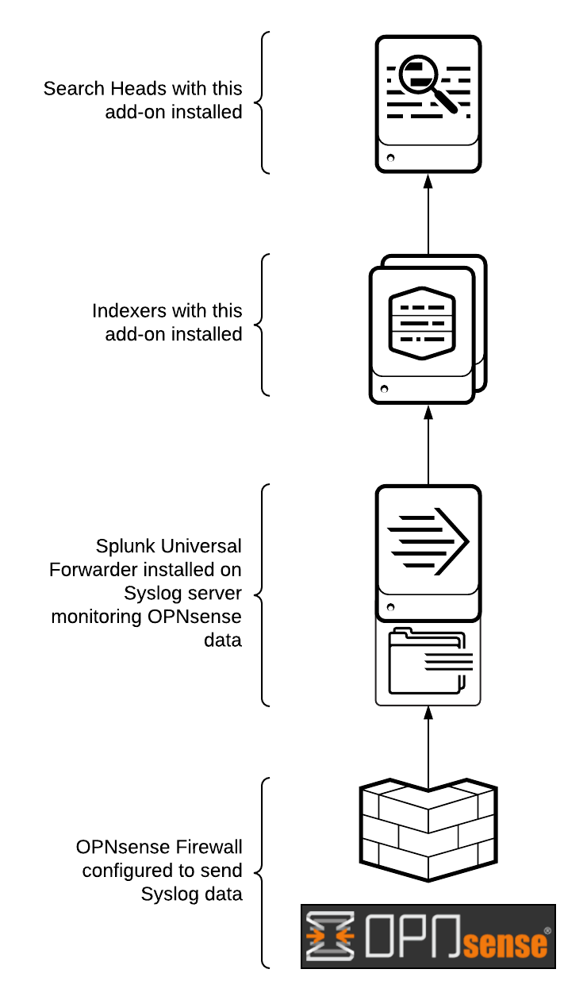

# Log Collection Architecture

{ loading=lazy width=350 align=right}

The following diagram shows a basic logging architecture to get data from the OPNsense firewall to Splunk. For more information on installation see [Where to install](../where-to-install/).

## Syslog Server Considerations

It is recommended to use an intermediate syslog server with a Splunk [Universal Forwarder](https://www.splunk.com/en_us/download/universal-forwarder.html) installed. This allows for reliable and secure data collection in Splunk. For more information on syslog and Splunk, see the (SYSLOG) Syslog Data Collection section of the [Splunk Validated Architectures](https://www.splunk.com/pdfs/technical-briefs/splunk-validated-architectures.pdf) white paper.

If you want to simply your deployment you can choose to send syslog data directly to Splunk. For more information on collecting data from TCP/UDP ports see [Splunk Docs: Get data from TCP and UDP ports](https://docs.splunk.com/Documentation/Splunk/latest/Data/Monitornetworkports).

This documentation will provide steps on configuring inputs from data being collected by a syslog server. See the [Guide: Syslog](../../guides/guide-syslog) for onboarding data via rsyslog/syslog-ng in this documentation.

## Single instance deployment

When you install this add-on to a single Splunk Enterprise instance, that instance serves as both search head and indexer and provides both search and storage capability. A single instance deployment can support a few users running concurrent searches, which is ideal for a small test environment.

## Distributed deployment

Distributed deployments consist of separate instances for indexers and search heads. In both single instance and distributed deployments using a universal forwarder to get data in is recommended.

--8<-- "includes/abbreviations.md"
